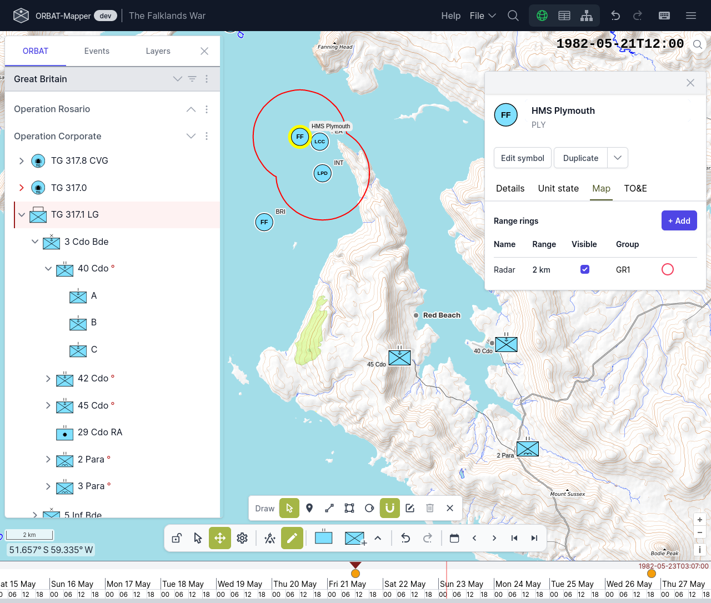

# ORBAT Mapper

ORBAT Mapper is a client side web application that lets you build order of battles (ORBATs) and plot unit locations on a
map. With
ORBAT Mapper you can recreate historic battles and military scenarios in your browser.

**Please note that this project is a work in progress.** You can try the work in progress version
at https://orbat-mapper.app/ and browse the documentation
at https://docs.orbat-mapper.app/.

_Screenshot:_



## Getting started

If you want to run ORBAT Mapper locally or developing your own version of ORBAT Mapper, you can do so by following these
steps:

Clone repo:

    $ git clone https://github.com/orbat-mapper/orbat-mapper.git

Navigate to project root:

    $ cd orbat-mapper

Install dependencies:

    $ npm install

To start a development server run:

    $ npm run dev

ORBAT mapper is now running on http://localhost:5173/. Any changes made to the source code will be instantly
available in the browser thanks to Vite's lightning fast hot module replacement.

For an optimized and minified build run:

    $ npm run build

The above command will output the optimized build to the `dist` directory. You can then serve the optimized build
locally by running:

    $ npm run preview

See https://vitejs.dev/guide/static-deploy.html for various deploy options.

## Using ORBAT Mapper without an internet connection

ORBAT Mapper is a static client side web application and can with some configuration changes be used without an
internet connection. However, by default ORBAT Mapper uses maps hosted on the internet, and an online service for
place name searching. So if you want to use ORBAT Mapper without an internet connection you need to provide your own
maps and host them locally.

It is possible to configure the default maps by following the instructions in the next section. For place name searching
there is currently no straightforward offline solution.

### Configuring default map layers

You can configure the default map layers by modifying the [`public/config/mapConfig.json`](public/config/mapConfig.json) file. When
building the application, the `mapConfig.json` file is copied to `dist/config/mapConfig.json`. You can also configure the basemap layers by modifying the
`dist/config/mapConfig.json` file directly, but keep in mind that the `dist` directory is overwritten when building the
application.

The `mapConfig.json` file contains an JSON array of basemap layers. Example:

```json
[
  {
    "title": "OSM (DE)",
    "name": "osm-de",
    "layerSourceType": "osm",
    "sourceOptions": {
      "url": "https://tile.openstreetmap.de/{z}/{x}/{y}.png",
      "crossOrigin": "anonymous"
    }
  },
  {
    "title": "Topographic Map Norway",
    "name": "kartverketTopo4",
    "layerSourceType": "xyz",
    "sourceOptions": {
      "crossOrigin": "anonymous",
      "url": "https://cache.kartverket.no/v1/wmts/1.0.0/topo/default/webmercator/{z}/{y}/{x}.png",
      "attributions": "<a href=\"http://www.kartverket.no/\">Kartverket</a>"
    },
    "tileLayerConfig": {
      "extent": [2, 57, 33, 72]
    }
  }
]
```

For an overview of the available configuration options see the `LayerConfigFile` type in [`layerConfigTypes.ts`](src/geo/layerConfigTypes.ts).

### Hosting your own maps

Local map hosting can be done in various ways, ranging in complexity from a simple local web server that serves a
directory tree of cached map tiles to a full-blown map server. Some options to explore:

- [TileServer GL](https://tileserver.readthedocs.io/en/latest/). [Tutorial](https://openmaptiles.org/docs/host/tileserver-gl/).
- [MapProxy](https://mapproxy.org/)
- [GeoServer](https://geoserver.org/)
- [MapTiler](https://www.maptiler.com/data/)
