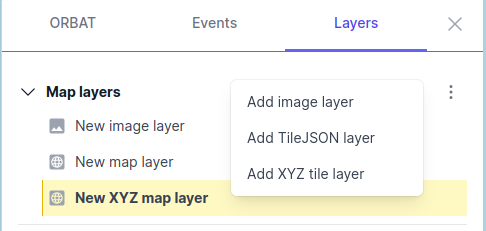

# Working with map background layers

ORBAT Mapper supports the following background layer sources:

- [XYZ tiles](#xyz-tiles)
- [TileJSON](#tilejson)
- [Images](#images)

## XYZ tiles

XYZ map tiles use a grid system to break up a map into small square tiles that can be loaded quickly in a web browser.
Each tile is a small image that covers a small area of the map, and the XYZ system allows for easy indexing and
retrieval of these tiles.

## TileJSON

[TileJSON](https://github.com/mapbox/tilejson-spec/tree/master/3.0.0) is a JSON based format designed to easily describe
a set of XYZ map tiles. The advantage of using TileJSON over XYZ tiles is that TileJSON usually contains information
about
attribution, available zoom levels and extent.

## Images

An image layer is simply a single image that is displayed on top of the map at a specific location. You can rotate and
scale it to fit the map.
